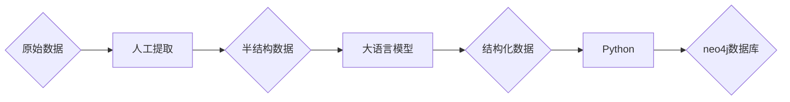
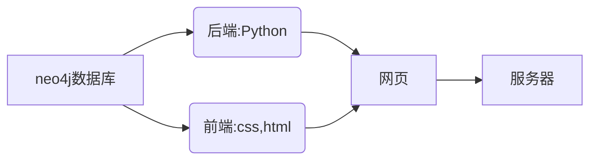

# 汽车系统动力学知识图谱

本系统以知识图谱技术为基础，实现对汽车系统动力学课程建立知识图谱，主要实现知识点与关系提取清洗、知识点信息更新、知识点搜索、知识化可视化界面等功能，分为服务器端和客户端两种用户。 服务器端可以在网站后台对节点与关系管理，用户通过Web界面在客户端自由查看与检索信息。
<p>
    <a href="https://www.anaconda.com/products/individual#Downloads"></a>
    <a href="https://www.python.org/downloads/windows/"></a>
</a>
   
## Demo

客户端网站：<https://kntongji.top>（建议使用电脑浏览器） \
服务端网站：<https://admin.kntongji.top>\
数据清洗工具：<https://convert.kntongji.top>


## 技术路线




```powershell
文件夹介绍

convert 数据转换工具
kn  图谱网站
edit_kn  知识修改更新工具
```

## 1.数据提取与清洗
### 效果展示
   
### 原理
在建立知识图谱过程中，对于数据的处理，更多人采用机器学习，深度学习等方法，但这些方法学习成本高，且对于逻辑性更强专业领域，更需要大量的数据集去训练。故本项目采用先用人工对教材等资料进行数据粗提取（如上图左框），再调用openAI提供的api接口，利用gpt-4o模型来对半结构化的数据进行转换为neo4j数据库能识别的三元组的形式（如上图右框）。具体原理见文件convert。

## 2.图谱的构建
### 效果展示


    
