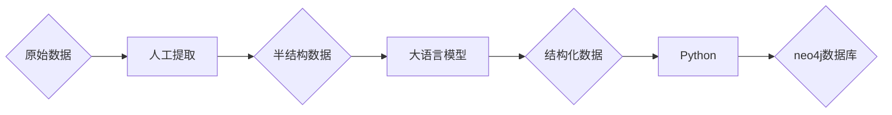
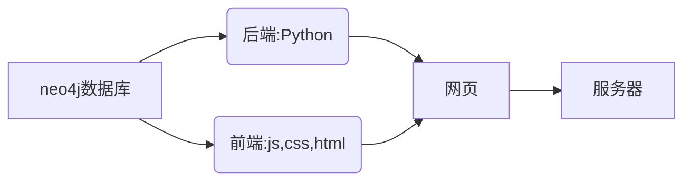

# 汽车系统动力学知识图谱
本系统以知识图谱技术为基础，实现对汽车系统动力学课程建立知识图谱，主要实现知识点与关系提取清洗、知识点信息更新、知识点搜索、知识可视化界面等功能，分为服务器端和客户端两种用户。 服务器端可以在网站后台对节点与关系管理，用户通过Web界面在客户端自由查看与检索信息。
<p>
    <a href="https://www.anaconda.com/products/individual#Downloads"></a>
    <a href="https://www.python.org/downloads/windows/"></a>
</a>


- [x] 图谱可视化
- [x] 后台管理系统
- [x] 基本用户交互
- [x] 关键字检索
- [ ] 多层级网页
- [ ] 智能问答
## 项目拓展

本项目利用人工提取和现有的语言大模型 (gpt-4o) 将数据转化为结构化数据，但此方法局限较高，且仅支持文本类数据，不支持图片和文件类型的数据。考虑以下扩展：
### 数据库构建
### 1. 数据清洗与转化
- **智能清洗**：未来可以引入机器学习和深度学习等技术，对原始数据进行智能清洗，以确保数据的准确性和一致性。可以尝试使用自然语言处理 (NLP) 技术来处理数据。
- **数据增强**：使用数据增强技术，生成更多结构化数据，以提高模型的训练效果。
### 2. 领域专用模型
- **专用知识库模型**：建立针对特定领域（如某门课程）的领域适配模型，这些模型可以更准确地理解和生成领域特定的知识内容，并支持知识问答和智能导师系统。
- **知识迁移**：通过迁移学习的方式，将已经训练好的模型在相关领域微调，提高模型效果并缩短训练时间。
### 3. 多模态支持
- **图像和视频支持**：考虑将图片、视频数据、公式和图表等数据纳入知识库，通过增强学习来自动提取和标注数据，以实现更丰富的显示效果和交互体验。
- **多模态问答系统**：构建一个可以处理多种输入类型的问答系统，例如用户可以输入文本或上传图片，系统能够识别并生成相应的回答。
### 4. 交互功能
- **开放 API**：为用户提供更灵活的交互方式，开放 API，允许开发者基于知识库构建自定义应用，支持多种编程语言的接口。
- **社区反馈**：考虑构建一个反馈机制，收集用户在使用过程中的体会和建议，这将有助于不断改进系统。
### 网站的构建
目前，网站的前后端框架较为简单，性能优化有待提升。以下是一些可以考虑的增强措施：
### 1. 更先进的框架
- **后端框架**：引入更先进的后端框架，如 Node.js，这将提升实时处理和并发处理的能力，同时也可以考虑使用 Express.js 进行服务端开发。
- **前端框架**：使用流行的前端框架（如 Vue.js 或 React），提高性能和用户体验。
### 2.更先进的技术
- **技术实践**：考虑实施代码分割、懒加载等技术，优化组件渲染性能，确保用户在使用期间获得流畅的体验。
- **缓存机制**：通过采用全面的缓存策略，减少服务器负担，提升响应速度。例如，可以使用 Redis 等工具进行数据缓存管理。
### 3. 优化用户界面
- **界面改善**：通过用户反馈不断迭代设计，注重界面能为用户提供的价值，提高使用黏性。
- **交互设计**：保障用户操作的便捷性，优化用户体验的同时设计出符合直觉的用户交互流程。
### 4. 安全性
- **加强安全措施**：实施 HTTPS、输入验证和反跨站请求伪造（CSRF）保护等措施，以保障用户数据的安全。
- **定期审计**：设立安全审计机制，定期检查系统的安全性，发现和处理潜在的安全漏洞。
   
## Demo
（建议使用电脑浏览器）\
客户端网站：<https://kntongji.top> \
服务端网站：<https://admin.kntongji.top>\
数据清洗工具：<https://convert.kntongji.top>


## 技术路线




```powershell
文件夹介绍

/convert  数据转换工具
/kn       图谱网站
/edit_kn  知识修改更新工具
/data     资料
```

## 1.数据提取与清洗
### 效果展示

### 原理
在建立知识图谱过程中，对于数据的处理，更多人采用机器学习，深度学习等方法，但这些方法学习成本高，且对于逻辑性更强专业领域，更需要大量的数据集去训练。故本项目采用先用人工对教材等资料进行数据粗提取（如上图左框），再调用openAI提供的api接口，利用gpt-4o模型来对半结构化的数据进行转换为neo4j数据库能识别的三元组的形式（如上图右框）。具体原理见文件convert。

## 2.图谱的构建
### 效果展示
#### 图谱样式

#### 搜索效果
  
#### 信息面板
 
### 原理
#### 后端架构
- 使用 Flask 框架搭建 Web 服务
- 使用 Neo4j 图数据库存储知识图谱数据
- 采用蓝图（Blueprint）模式组织路由
#### 前端架构
- 使用 vis.js 库实现知识图谱的可视化
- 采用模块化设计，分离不同功能组件
- 实现响应式布局，适配不同设备
- 使用 ES6 模块系统组织代码

## 3.图谱的更新
### 效果展示
#### 图谱更新

### 原理
与图谱展示类似，利用Flask框架搭建web服务，利用Python连接neo4j来实现图谱信息的修改。
## 声明
本项目为学习项目，本人亦是初学者。由于时间仓促，且本项目大量使用ai生成代码，代码优化空间还很大，请见谅！


    
